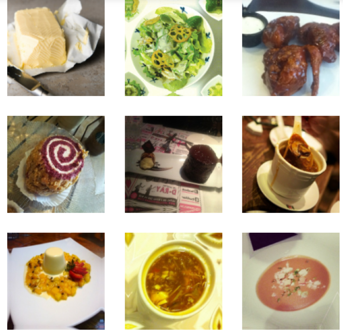
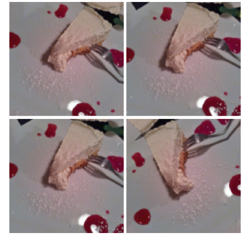
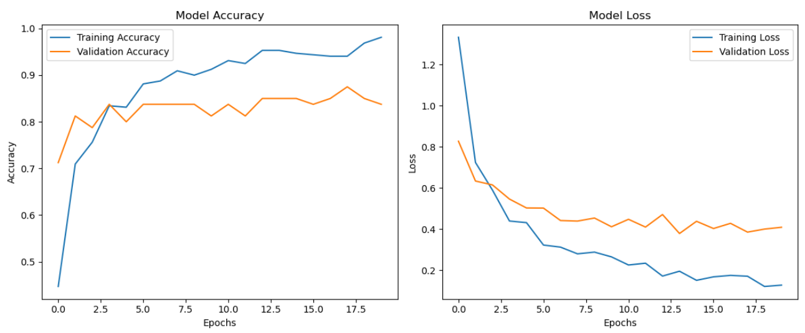
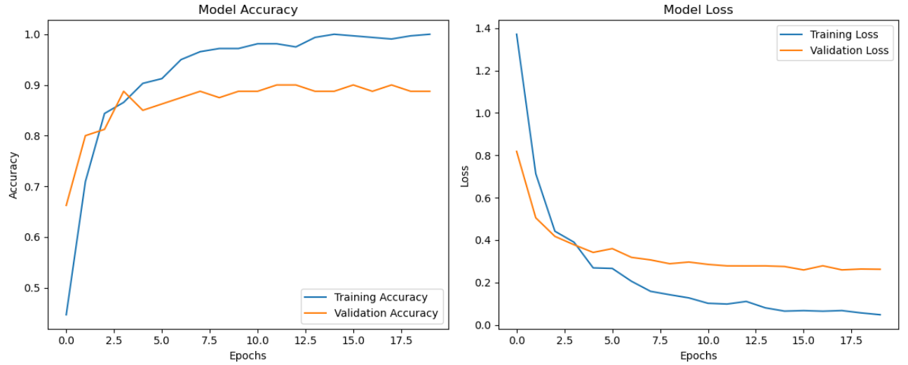
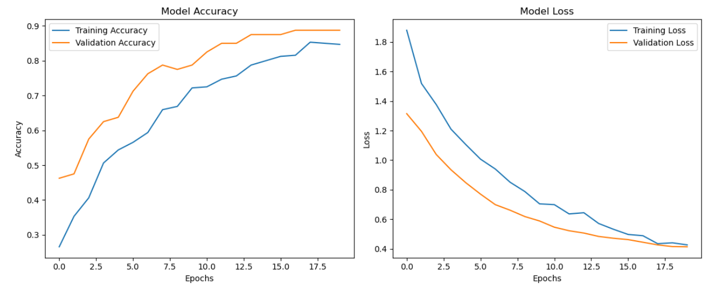
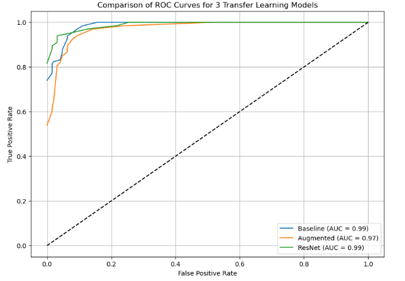
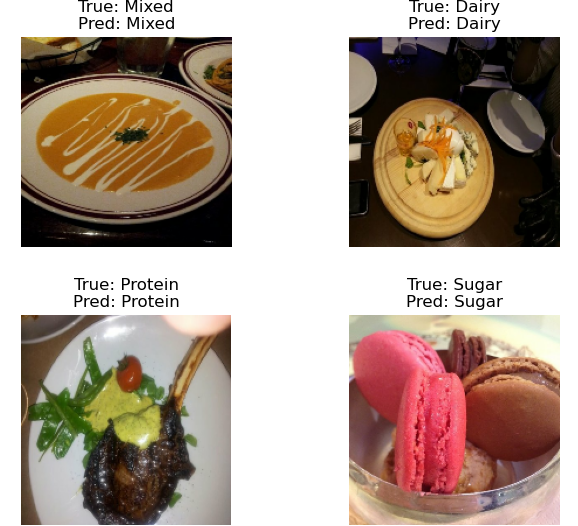

#  Food Image Classification with Transfer Learning

This project implements a complete image classification pipeline to categorize food images using deep learning techniques. I compare three different modeling approaches under constrained data conditions to understand how techniques like augmentation and transfer learning affect model performance when data is limited. The best-performing model achieved an **ROC-AUC of ~0.99** which was the ResNet model, demonstrating that efficient techniques can deliver strong results without large datasets.

---

##  Project Overview

###  Objective

To build and compare the performance of:
- A **simple CNN** baseline
- The same CNN with **data augmentation**
- A **ResNet50**-based **transfer learning model**

By restricting the dataset to **4 classes** and ~115 images/class, the focus was on **performance optimization under limited resources** — a common real-world scenario in early-stage projects or research prototyping.

---

##  Why This Project Matters

Food image classification is a valuable real-world application with relevance in areas like fitness tracking, calorie estimation, and personalized health tech. This project explores how deep learning models can be effectively applied even in low-data environments, where collecting large labeled datasets may not be feasible. By carefully selecting architectures and applying strategies like data augmentation and transfer learning, I was able to achieve strong performance while keeping the pipeline lightweight and efficient. Beyond the technical results, this project also served as a hands-on opportunity to build a modular, reusable deep learning workflow and deepen my understanding of how different modeling choices affect generalization.

---

##  Dataset Summary

- **Source**: [Kaggle Food11 Dataset](https://www.kaggle.com/datasets/trolukovich/food11-image-dataset)
- **Original Categories**: 11
- **Chosen Subset**:  
  - `Dairy` → Renamed to `Dairy`  
  - `Dessert` → Renamed to `Sugar`  
  - `Meat` → Renamed to `Protein`  
  - `Soup` → Renamed to `Mixed`

I chose these classes for **distinct visual characteristics** to help models learn clearly separable features. Limiting each class to ~115 images mimics real-world constraints (e.g., few labeled samples in medical imaging or food tracking apps).



---

##  Preprocessing Strategy

-To streamline training and simulate a practical low-data scenario, I selected **four visually distinct food categories** from the original Food11 dataset. Each class was capped at **a maximum of 115 images**, reflecting common constraints in real-world applications such as tasks with limited labeled data.

-Images were **rescaled from [0, 255] to [0, 1]** using normalization, which helped stabilize training by ensuring consistent input distributions and accelerating convergence. Labels were **one-hot encoded**, making them compatible with the **categorical crossentropy** loss function used for multi-class classification.

**This preprocessing setup ensured:** 
- Uniformity in image input format  
- Efficient memory and training use  
- Proper label encoding for probabilistic output





*Finally, I manually inspected the images to confirm correct labeling and remove any visually misleading or corrupted samples. These steps helped ensure that the models were trained on clean, balanced, and well-prepared data.

---

### 1. **Baseline Model (MobileNetV2, No Fine-Tuning)**

**Approach:**
- Pretrained **MobileNetV2** used as a frozen feature extractor.
- Built a classification head: `GlobalAveragePooling2D → Dropout → Dense(softmax)`.
- No data augmentation applied.
  
**Training:**
- 320 training and 80 validation images (80/20 split).
- Trained for 20 epochs using categorical crossentropy.
  
**Results:**
- **Training Accuracy:** 100%
- **Validation Accuracy:** **90.0%**

**Takeaway:** Fast convergence but some overfitting. Excellent baseline performance with minimal configuration.


---

### 2. **Augmented Model (MobileNetV2 + Data Augmentation)**

**Approach:**
- Same MobileNetV2 architecture as the baseline.
- Added a data augmentation layer (`RandomFlip`, `RandomRotation`, `RandomZoom`) before the model input.

**Training:**
- Same dataset and epochs as baseline.

**Results:**
- **Training Accuracy:** 97.7%
- **Validation Accuracy:** **87.5%**


**Takeaway:** Slight drop in accuracy, but significantly better generalization and reduced overfitting. Great for deployment scenarios.

---

### 3. **ResNet50**

**Approach:(Removed Fine-tuning)**
- Used **ResNet50** pretrained on ImageNet with all layers frozen.
- Applied `resnet50.preprocess_input()` before passing inputs to the model.
- Used the same classification head as other models.

**Training:**
- Same dataset and 20-epoch training strategy.

**Results:**
- **Training Accuracy:** 83.4%
- **Validation Accuracy:** **88.8%**


**Takeaway:** More stable learning and higher generalization. Performance improved steadily over epochs despite being slower to converge.

---

## Final Model Comparison

| Model             | Train Acc | Val Acc | Notes                                        |
|------------------|-----------|---------|----------------------------------------------|
| **Baseline**      | 100%      | 90.0%   | High overfitting, fast convergence           |
| **Augmented**     | 97.7%     | 87.5%   | Better generalization, improved robustness   |
| **ResNet50**      | 83.4%     | 88.8%   | Slower training, stronger late-stage results |

### Insights:

 **Baseline Model (MobileNetV2, no augmentation)** achieved an **AUC of 0.99**, showing strong performance despite its simplicity. It captures the universal features well but may overfit on small datasets.
  
 **Augmented Model** introduced random image transformations to simulate data variability. While its **AUC dropped slightly to 0.97**, this model is expected to generalize better in real-world scenarios.

**ResNet50 Model** also reached an **AUC of 0.99**, indicating excellent discrimination power. However, its slower convergence suggests that fine-tuning or more data might be needed for best results.

All three models performed competitively, with the **Baseline and ResNet50 models leading in AUC**. The Augmented model, though slightly behind in score, provides better robustness and reduced overfitting — ideal for deployment.

The following ROC curve visualizes and compares the classification performance of three transfer learning models using **macro-averaged AUC scores** across four food image classes:



---

### Summary

This work demonstrates three different transfer learning approaches:
- **Baseline**: Evaluates pure pretrained feature extraction without regularization.
- **Augmented**: Adds synthetic variety to training for better generalization.
- **ResNet50**: Leverages a deeper architecture to extract rich features and improve long-term performance.

Each model provides insight into how architecture, augmentation, and training strategies impact performance in low-data scenarios.




## Training Configuration

**Epochs set to 20**  
  Training for 20 epochs offered a good balance between learning and overfitting. While early epochs showed rapid improvement, later epochs helped the model refine class boundaries, especially when using transfer learning. With a small dataset, this longer schedule worked well due to early stopping tendencies of validation accuracy.

 **Batch size of 16**  
  A batch size of 16 ensured smooth training without memory issues on CPU. It struck a balance between training stability and model generalization, avoiding the pitfalls of very small (noisy) or very large (sluggish) batches.

 **Adam optimizer with learning rate of 3e-4**  
  Adam's adaptive learning helped the model converge faster and more reliably. The learning rate of 3e-4 worked well across models, avoiding both slow convergence and instability.

 **Categorical crossentropy as the loss function**  
  Since the task involved multi-class classification with one-hot labels, categorical crossentropy was appropriate. It penalized incorrect predictions proportionally and helped models learn class probabilities effectively.

 **Monitored accuracy and ROC-AUC**  
  Accuracy provided a clear measure of performance, but ROC-AUC helped capture class-wise separation and confidence, which was especially valuable given the class imbalance and small dataset size.

---

##  Key Observations

*Data augmentation significantly improved validation stability, especially when paired with transfer learning, helping the model avoid overfitting to the small dataset.
*Transfer learning (ResNet50, MobileNetV2) showed strong performance, but required proper freezing and fine-tuning to match or outperform simpler models — confirming its value only when carefully applied.
*A custom CNN, even without pretraining, reached high AUC but suffered in validation accuracy, suggesting that deeper models generalize better with limited yet diverse data.
*The modular pipeline allowed rapid testing of augmentation strategies, pretrained backbones, and training settings — making iteration efficient and scalable.

---

##  Future Extensions

- **Full Dataset Use**: Scale up to all 11 classes and larger sample sizes  
- **Architecture Swaps**: Try EfficientNet, Vision Transformers (ViT), or MobileNetV3  
- **Preprocessing Enhancements**: Apply segmentation to isolate food from background  
- **Multilabel Support**: Handle real-world composite dishes with overlapping categories  
- **Web App Interface**: Add prediction UI with Streamlit or Flask  
- **AutoML**: Use tools like Keras Tuner or AutoKeras for hyperparameter optimization

---


## Reproducibility Steps

### 1. Download & Prepare Data
- From: [Kaggle: Food11 Dataset](https://www.kaggle.com/datasets/trolukovich/food11-image-dataset)
- Select 4 folders: `Dairy`, `Dessert`, `Meat`, `Soup`
- Rename and reorganize into: `Dairy`, `Sugar`, `Protein`, `Mixed`

### 2. Run Notebooks from Folder in This Order


 `DataLoader.ipynb`                Load, preprocess, normalize, label encode   
 `TrainBaseModel.ipynb`            Train MobilNetV2                   
 `TrainBaseModelAugmentation.ipynb`  Add augmentation and retrain MobilNetV2               
 `Train-ResNet.ipynb`             Transfer learning with ResNet50             
 `CompareAugmentation.ipynb`      ROC-AUC plots for baseline vs augmented    
`CompareModels.ipynb`             Final evaluation + model comparison table   
`TestModel2.ipynb`                 View predictions on test samples            

---

##  Setup & Installation

Install required libraries using pip:

```bash
pip install tensorflow numpy matplotlib scikit-learn
