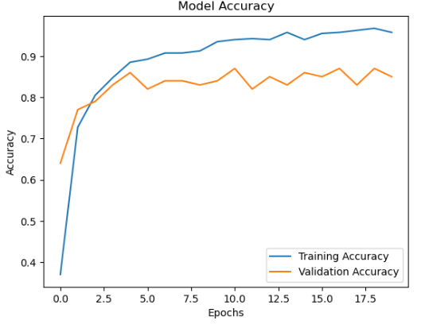
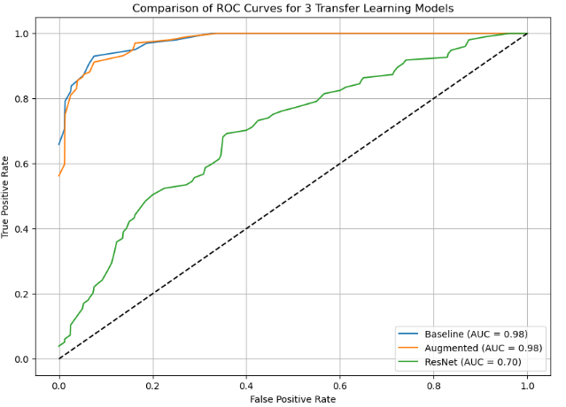
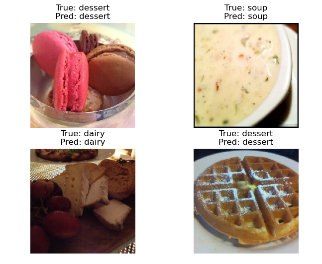

# Food Image Classification with Transfer Learning

This project applies deep learning to classify food images into four categories using a subset of the [Food11 dataset](https://www.kaggle.com/datasets/trolukovich/food11-image-dataset). I evaluated a baseline CNN, its augmented version, and a ResNet50 transfer learning model to compare performance in a resource-constrained scenario. The best model achieved an average ROC-AUC of ~0.98.

---

##  Project Overview

###  Objective
To classify food images using deep learning models and compare the performance of:
- A baseline CNN
- A CNN with data augmentation
- A transfer learning model using ResNet50

I limited the dataset to ≤100 images per class and selected 4 target categories to reduce training time and facilitate faster prototyping.

###  Why This Project Matters
Food image classification is a practical use case in applications like calorie tracking, dietary recommendation systems, and AI-enhanced cooking apps. By leveraging transfer learning, this project shows how high performance can be achieved with relatively small labeled datasets.

---

##  Tech Stack

- **Language:** Python
- **Libraries:** TensorFlow, NumPy, Matplotlib, scikit-learn
- **Hardware:** Local machine with 8 GB RAM
- **Training Time:** ~20 seconds per model on CPU

---

##  Data

- **Dataset:** [Food11 Kaggle Dataset](https://www.kaggle.com/datasets/trolukovich/food11-image-dataset)
- **Selected Classes:** `Dairy`, `Dessert`, `Meat`, `Soup`
- **Subset Size:** 115 images per class
- **Format:** JPEG files in class-specific folders
- **Split:** 80% training / 20% validation

---

##  Preprocessing

- Selected 4 food classes and limited to ≤100 images/class
- Normalized pixel values (rescale to [0, 1])
- One-hot encoded class labels
- Visual inspection to verify dataset integrity

---

## Models Trained

### 1. Baseline CNN  
- Standard Conv2D + MaxPooling blocks  
- Batch normalization, dropout  
- Achieved ~0.98 ROC-AUC

### 2. CNN + Augmentation  
- Added: random flip, zoom, rotation  
- Slightly better generalization than baseline  
- Achieved ~0.98 ROC-AUC  



### 3. ResNet50 (Transfer Learning)  
- Pretrained on ImageNet  
- Fine-tuned classification head  
- Lower performance: ~0.70 ROC-AUC  
> Possibly due to overfitting on small dataset

---

##  Training & Evaluation

- **Epochs:** 20  
- **Batch Size:** 16  
- **Optimizer:** Adam (LR = 3e-4)  
- **Loss:** Categorical Crossentropy  
- **Metrics:** Accuracy, ROC-AUC

Each model's training/validation curves and ROC plots are included in evaluation notebooks.
---

##  Performance Summary

| Model              | Avg. ROC-AUC | Comments                     |
|-------------------|--------------|------------------------------|
| Baseline CNN       | ~0.98        | Solid performance            |
| Augmented CNN      | ~0.98        | Best overall generalization  |
| ResNet50 Transfer  | ~0.70        | Underperformed on small data |



---

##  Feature Highlights

- Data-efficient training with ≤100 images per class
- Use of transfer learning for performance benchmarking
- Augmentation improves generalization in small datasets
- Clear modular pipeline across data loading, training, and evaluation

---

##  Future Work

- **Expand Dataset:** Use all 11 classes with >1000 images/class  
- **Try Other Architectures:** MobileNetV2, EfficientNet, or ViT  
- **Image Segmentation:** Preprocess images to isolate food  
- **Multilabel Classification:** Handle mixed/compound food categories  
- **Deploy Web App:** Add prediction UI using Streamlit or Flask  
- **AutoML Comparison:** Use Keras Tuner or AutoKeras for hyperparameter tuning

---

##  How to Reproduce

1. Download and extract [Food11 dataset](https://www.kaggle.com/datasets/trolukovich/food11-image-dataset)
2. Run each notebook in the following order:

###  Pipeline Steps

| Notebook                         | Purpose                                |
|----------------------------------|----------------------------------------|
| `DataLoader.ipynb`               | Load and preprocess selected classes   |
| `TrainBaseModel.ipynb`           | Train simple CNN baseline              |
| `TrainBaseModelAugmentation.ipynb` | Train same model with augmentation  |
| `Train-ResNet.ipynb`             | Transfer learning with ResNet50        |
| `CompareAugmentation.ipynb`      | Compare baseline vs augmented ROC-AUC  |
| `CompareModels.ipynb`            | Evaluate and compare all models        |
| `TestModel.ipynb`                | Visualize predictions on test samples  |

## TestModel:


---

##  Requirements

Install required libraries:

```bash
pip install tensorflow numpy matplotlib scikit-learn
